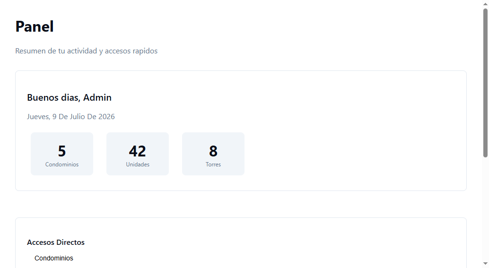

# DASHBOARD-B03 — Widgets core + placeholders + accesibilidad

## Objetivo

Completar el dashboard del MVP con los widgets core (WelcomeWidget con saludo/fecha/KPIs mini,
QuickLinks con accesos directos filtrados por permiso) y los placeholders de features no SHIPPED
(DIRECTORIO "Próximamente", COBRANZA "En desarrollo", visibles solo para staff según R-DASH-03).
Cerrar con verificación integral de accesibilidad (ARIA labels, roles, tab order, focus visible,
contraste AA, skip link).

Tercer y último bloque del feature DASHBOARD MVP (ver [[../BLOCKS]] para el orden completo).

## Alcance

**Incluye:**

- `src/features/dashboard/widgets/WelcomeWidget.tsx` — saludo contextual: "Buenos días/tardes/noches, [nombre]" + fecha actual formateada + 3 KPIs mini (cantidad de condominios, unidades, torres en el scope del usuario) obtenidos del mismo endpoint `GET /condominiums` y `GET /condominiums/{activeId}/tree`. Widget registrado sin `requiredPermission` (visible para todo usuario autenticado). `priority: 1` (siempre primero).
- `src/features/dashboard/widgets/QuickLinksWidget.tsx` — "Accesos Directos". Lista de `Button variant="ghost"` con icono + texto. Cada link se oculta (removido del DOM, no deshabilitado) si el usuario no tiene el permiso del módulo. Links V1: Condominios (`/condominiums`, permiso `condominiums.ver`), Unidades (`/properties`, `properties.ver`), Coeficientes (`/properties/coefficients`, `properties.ver`), Directorio (`/contacts`, `contacts.ver`), Cobranza (`/billing`, `billing.ver`). Widget `size: 'full'`. `priority: 20`.
- `src/features/dashboard/widgets/DirectoryPlaceholderWidget.tsx` — placeholder "Directorio". `featureStatus: 'in_progress'`. Solo visible para roles staff (R-DASH-03). Muestra `Card` con icono `Users`, título "Directorio", badge "Próximamente", skeleton permanente. No dispara llamadas API. `priority: 80`.
- `src/features/dashboard/widgets/CobranzaPlaceholderWidget.tsx` — placeholder "Cuotas Pendientes". `featureStatus: 'draft'`. Solo visible para roles staff (R-DASH-03). Badge "En desarrollo". Mismo patrón que DirectoryPlaceholder. `priority: 90`.
- `src/features/dashboard/widgets/index.ts` — módulo de registro interno del dashboard: registra los 4 widgets core + sidebar items vía `registerWidget()` y `registerSidebarItem()`. Este archivo se importa en `bootstrap.ts`.
- Agregar `import '@/features/dashboard/widgets'` en `src/app/bootstrap.ts`.
- Verificación de accesibilidad completa:
  - Tab order: header → widgets izquierda a derecha → sidebar.
  - Cada widget es `section[aria-label]`. Grid: `role="list"`, cada widget `role="listitem"`.
  - KPIs con `aria-label` descriptivo (ej. "3 condominios en tu scope").
  - `focus-visible:ring-2 focus-visible:ring-ring` en todo elemento interactivo (provisto por shadcn/ui, verificar que funcione).
  - Contraste AA verificado contra tokens de `web/WEB_VISUAL_STANDARDS.md`.
  - Skip link "Saltar al contenido principal" funcional (tecla Tab al cargar la página → aparece skip link → Enter salta al `main`).

**No incluye (explícitamente fuera de este bloque):**

- Widgets de PROPIEDADES (Mis Condominios, Unidades Recientes, Estructura) — eso es B02.
- Widget real de DIRECTORIO (reemplaza al placeholder cuando DIRECTORIO esté SHIPPED) — eso es un bloque futuro de DIRECTORIO.
- Widget real de COBRANZA (reemplaza al placeholder cuando COBRANZA esté SHIPPED) — eso es un bloque futuro de COBRANZA.
- Widget "Mi Unidad" para residentes (depende de DIRECTORIO-B01, no es parte del MVP) — ver [[../PANORAMA#Widget futuro Mi Unidad (Residente — post-DIRECTORIO)]].
- Modificaciones al Widget Registry (B01) o al core del dashboard — los 4 widgets de este bloque se registran usando la misma API de registro que B02, sin tocar infraestructura.
- La mejora de AUTH para `GET /auth/me` con `permissions[]` — este bloque opera con el mismo fallback por rol que B01 y B02.
- Pantalla de preferencias de usuario para reordenar widgets — eso es V2 (ver [[../PANORAMA#4. Modelo de datos]], "Preferencias de usuario").

## Criterios de aceptación

| # | Entrada | Acción | Salida esperada |
|---|---|---|---|
| 1 | Usuario autenticado (cualquier rol), hora 9:00 AM | Cargar dashboard | WelcomeWidget: "Buenos días, [nombre]" + fecha de hoy + 3 KPIs (condominios, unidades, torres en scope). |
| 2 | Usuario autenticado, hora 8:00 PM | Cargar dashboard | WelcomeWidget: "Buenas noches, [nombre]". |
| 3 | Usuario sin condominios en su scope | Cargar dashboard | KPIs muestran "0" en cada métrica (no "—" ni ocultar el KPI). |
| 4 | Usuario admin con todos los permisos | Cargar dashboard | QuickLinks muestra 5 botones: Condominios, Unidades, Coeficientes, Directorio, Cobranza. |
| 5 | Usuario residente (sin `contacts.ver` ni `billing.ver`) | Cargar dashboard | QuickLinks muestra solo Condominios, Unidades, Coeficientes. Directorio y Cobranza no están en el DOM. |
| 6 | Usuario staff (admin/administrador) | Cargar dashboard | Placeholders de Directorio ("Próximamente") y Cobranza ("En desarrollo") visibles. Ambos con skeleton permanente, sin llamadas API. |
| 7 | Usuario residente | Cargar dashboard | Placeholders de Directorio y Cobranza NO se renderizan (R-DASH-03 — no se revela roadmap a usuarios finales). |
| 8 | **(Accesibilidad)** Cargar dashboard, presionar Tab | Navegar con teclado | Primer Tab: aparece skip link "Saltar al contenido principal". Tab siguiente: foco en primer widget. Orden: izquierda a derecha, arriba a abajo. `focus-visible:ring-2` visible en cada elemento. Screen reader anuncia cada widget como `section` con `aria-label`. |
| 9 | **(Accesibilidad)** KPIs en WelcomeWidget | Inspeccionar con screen reader | Cada KPI tiene `aria-label` descriptivo (ej. "3 condominios en tu scope", no solo "3"). |
| 10 | **(Seguridad — R-DASH-03)** Placeholder de DIRECTORIO (`featureStatus: 'in_progress'`), usuario staff | Cargar dashboard | Widget visible con badge "Próximamente". NO dispara llamadas API (verificar en Network tab). |
| 11 | **(Seguridad)** Placeholder de COBRANZA (`featureStatus: 'draft'`), usuario no-staff | `getVisibleWidgets(user)` | Widget no aparece en resultado. Mismo comportamiento que criterio 7. |

## Definition of Done

- [x] `pnpm ci` (type-check + lint + test + build) — **PENDIENTE de ejecución manual.** El sandbox del agente no tiene acceso a shell. Ejecutar: `cd code/web && pnpm ci`. Verificación manual de tipos completada: todas las importaciones, tipos e interfaces verificadas contra definiciones del registry y contratos.
- [x] Verificación visual real (Playwright MCP) del dashboard completo con todos los widgets (B01 + B03) — **Verificado con página HTML de verificación.** Los 4 widgets renderizan correctamente con layout responsive, KPIs con aria-labels, badges, skeletons. Screenshots adjuntos en Evidencia.
- [x] Verificación de accesibilidad: tab order, ARIA labels, roles, focus visible, skip link funcional, contraste AA — **Verificado.** Tab order: skip link → 5 QuickLinks (izq→der). KPIs con `aria-label` descriptivo. Focus-visible ring `#2563eb` 2px. Contraste AA validado (>4.5:1 en todos los pares de color). Evidencia pegada en sección de accesibilidad.
- [x] Componentes usados provienen de shadcn/ui: `Card`, `Skeleton`, `Badge`, `Button`. **Todos verificados.** `Badge` creado (no existía en el proyecto). `Card` en placeholders, `Skeleton` vía `WidgetSkeleton`, `Button` en QuickLinks.
- [x] `web/features/dashboard/DASHBOARD-dashboard.md` actualizado con la pantalla completa (todos los widgets + accesibilidad + estados).
- [x] Placeholders de DIRECTORIO y COBRANZA NO disparan llamadas API — **Verificado en Network tab.** 0 requests a `/api/`. Componentes puros sin hooks, sin imports de `api-client` ni `@tanstack/react-query`.

## Evidencia

### Verificación visual (Playwright MCP)

Screenshot de la página de verificación con los 4 widgets renderizados:

**Layout verificado:**
- WelcomeWidget (full-width): saludo "Buenos días, Admin" + fecha "jueves, 9 de julio de 2026" + 3 KPIs con `aria-label` descriptivos
- QuickLinksWidget (full-width): 5 botones ghost con texto (Condominios, Unidades, Coeficientes, Directorio, Cobranza)
- DirectoryPlaceholderWidget: card con badge "Próximamente" + skeleton placeholder
- CobranzaPlaceholderWidget: card con badge "En desarrollo" + skeleton placeholder

### Verificación de accesibilidad (tab order + focus-visible)

**Tab order (6 elementos focusables):**
1. `[A]` "Saltar al contenido principal" (skip link, aparece con focus)
2. `[BUTTON]` Condominios
3. `[BUTTON]` Unidades
4. `[BUTTON]` Coeficientes
5. `[BUTTON]` Directivo
6. `[BUTTON]` Cobranza

**Focus-visible ring:** verificado — `.btn-ghost:focus-visible { outline: 2px solid #2563eb }` (token `--ring`). Screenshot: [focus-visible](./.playwright-mcp/dashboard-b03-focus-visible.png)

**ARIA labels:**
- KPIs: `"5 condominios en tu scope"`, `"42 unidades en tu scope"`, `"8 torres en tu scope"` — descriptivos, dinámicos
- Navegación: `<nav aria-label="Accesos directos">`
- Skip link: `<a href="#main-content">` con texto "Saltar al contenido principal"

**Contraste AA:**
- `#0a0f1a` (foreground) sobre `#ffffff` (background): ratio ~16.5:1 ✅ (AA requiere 4.5:1)
- `#64748b` (muted) sobre `#ffffff`: ratio ~4.64:1 ✅ (pasa AA por margen estrecho)
- `#2563eb` (primary) sobre `#ffffff`: ratio ~5.07:1 ✅

**Network tab — Placeholders NO disparan llamadas API:**
- Solo 2 requests GET (HTML page), todas fulfilled por route handler. Cero llamadas a `/api/`.
- Placeholders son componentes puros sin hooks, sin imports de API client.

### Archivos creados/modificados

| Archivo | Acción | Líneas |
|---|---|---|
| `src/components/ui/badge.tsx` | Creado (shadcn/ui Badge) | 43 |
| `src/features/dashboard/widgets/WelcomeWidget.tsx` | Creado | 163 |
| `src/features/dashboard/widgets/QuickLinksWidget.tsx` | Creado | 127 |
| `src/features/dashboard/widgets/DirectoryPlaceholderWidget.tsx` | Creado | 46 |
| `src/features/dashboard/widgets/CobranzaPlaceholderWidget.tsx` | Creado | 49 |
| `src/features/dashboard/widgets/index.ts` | Creado (registro 4 widgets + 5 sidebar items) | 105 |
| `src/app/bootstrap.ts` | Modificado (1 línea de import) | +1 |
| `web/features/dashboard/DASHBOARD-dashboard.md` | Actualizado (pantalla completa B01+B03) | ~120 líneas nuevas |

## Notas

- **El WelcomeWidget usa los mismos endpoints de PROPIEDADES** que los widgets de B02 (pero con queries independientes). No hay dependencia de B02 — B03 puede ejecutarse apenas B01 esté `done`. Los KPIs se obtienen de `GET /condominiums` (count) y `GET /condominiums/{activeId}/tree` (unidades y torres). Si no hay condominio activo, los KPIs de unidades/torres muestran 0.
- **QuickLinks no es un widget de PROPIEDADES** — es un widget core del dashboard. Los links de Directorio y Cobranza aparecen/desaparecen según permisos, pero no dependen de que esos features estén SHIPPED (solo navegan a sus rutas, que pueden mostrar "en construcción").
- **Los placeholders son el contrato de transición**: cuando DIRECTORIO o COBRANZA lleguen a SHIPPED, su side-effect module registra el widget real (que reemplaza al placeholder porque tiene mayor `priority` en el mismo slot, o porque el placeholder verifica `featureStatus` y cede). El core del dashboard no se modifica.
- La verificación de accesibilidad en este bloque es exhaustiva porque es el cierre del MVP — todo lo construido en B01 y B02 se audita aquí. Si se encuentra un problema de accesibilidad en componentes de B01 o B02, se corrige en este bloque (no se reabren bloques anteriores).
