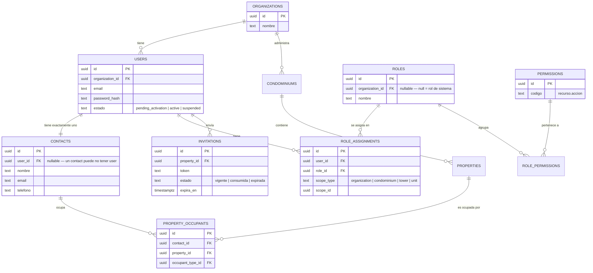

# DATA_MODEL — Convenciones de esquema y tablas fundacionales

> Convenciones que toda tabla nueva del sistema debe respetar, más las tablas base que implementan
> [[adr/ADR-001-actor-party]] y sobre las que se construye el feature AUTH. Este documento **no**
> es el esquema completo del sistema — cada feature agrega sus propias tablas siguiendo estas
> convenciones, documentadas en su propio `PANORAMA.md` §4 y materializadas en `api/API_DATABASE.md`
> a medida que sus bloques se ejecutan.

## 1. Convenciones de esquema (obligatorias para toda tabla nueva)

| Convención | Regla |
|---|---|
| Clave primaria | `id` UUID v7 (ordenable por tiempo de creación, sin exponer secuencia) |
| Claves foráneas | `{tabla_singular}_id` (ej. `contact_id`, `property_id`) |
| Timestamps | `created_at`, `updated_at` (timestamptz), automáticos |
| Borrado | Soft delete vía `deleted_at` (timestamptz nullable) — nunca `DELETE` físico sobre datos de negocio |
| Migraciones | Toda migración debe tener un `down()` reversible y probado (ver DoD de API en `_system/05_DEFINITION_OF_DONE.md`) |
| Valor vs. Referencia | Un campo es **Referencia** (tabla/catálogo propio + FK) cuando necesita lista controlada, integridad referencial, o se filtra/agrupa por él; es **Valor** (columna inline) cuando es texto libre o poco reutilizado. Si es ambiguo, se documenta como pregunta abierta en el panorama del feature — nunca se asume. |

## 2. Tablas fundacionales (ADR-001 — sustrato de identidad, tenant y autorización)

Estas tablas no pertenecen a un feature de negocio específico — son el sustrato que AUTH y todo lo
que dependa de identidad/permisos necesita. Se crean en los bloques tempranos de AUTH (ver
[[../features/AUTH/BLOCKS]]).

## 3. Qué NO está aquí

El detalle de columnas completo, índices y constraints reales vive en `api/API_DATABASE.md` — se
llena a medida que los bloques que crean cada tabla llegan a `done` (parte del DoD de API, ver
`_system/05_DEFINITION_OF_DONE.md` §2). Este documento fija las convenciones y la forma conceptual;
`API_DATABASE.md` es la fuente de verdad del esquema físico real una vez implementado.
